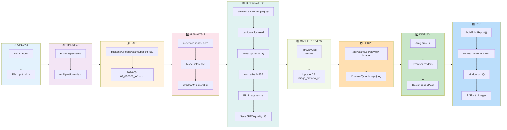
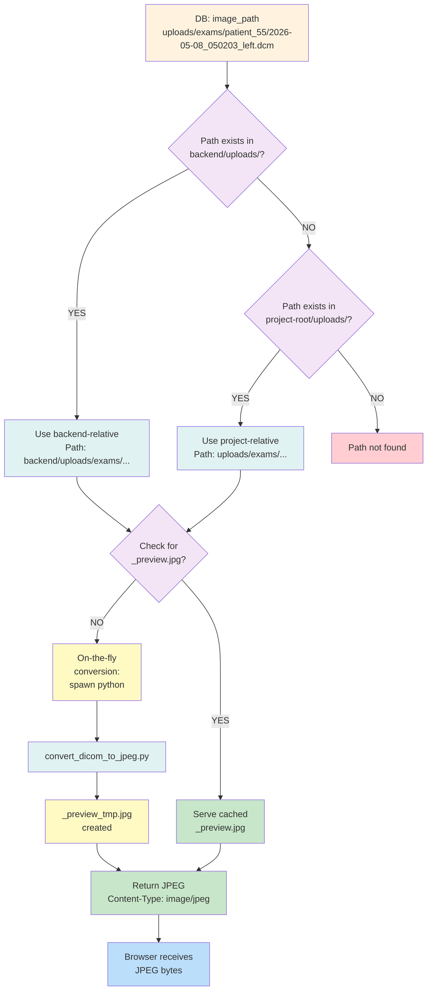

# DICOM → JPEG Flow Diagram (Mermaid)

## Complete Data Flow - Admin to Doctor

```mermaid
graph TD
    A["👨‍💼 ADMIN<br/>Upload .dcm"] -->|POST /api/exams<br/>multipart/form-data| B["📁 FILE SYSTEM<br/>backend/uploads/exams/patient_55/"]
    
    B -->|Stored| C["📄 DICOM FILE<br/>2026-05-08_050203_left.dcm<br/>~500KB"]
    
    C -->|image_path| D["🗄️ DATABASE<br/>exams table<br/>INSERT"]
    
    D -->|id: 219<br/>status: analyzing| E["🤖 AI SERVICE<br/>FastAPI<br/>EfficientNet/ResNet"]
    
    E -->|pixel_array +<br/>Grad-CAM| F["🎨 OUTPUTS SAVED"]
    
    F -->|Grade + Conf.| D
    F -->|Heatmap PNG| C
    
    D -->|image_path| G["🔄 PREVIEW GENERATION"]
    
    G -->|Batch or<br/>On-Demand| H["🐍 convert_dicom_to_jpeg.py"]
    
    H -->|pydicom +<br/>PIL| I["🖼️ JPEG PREVIEW<br/>2026-05-08_050203_left<br/>_preview.jpg<br/>~11KB"]
    
    I -->|_preview_url| D
    
    J["👨‍⚕️ DOCTOR<br/>View /doctor/exams/219"] -->|GET /api/exams/219| D
    
    D -->|image_url<br/>image_preview_url<br/>heatmap_url| K["🌐 FRONTEND JS<br/>exam-detail.html<br/>renderExam()"]
    
    K -->|image_display_url =<br/>preview_url || API| L["📺 BROWSER<br/>DISPLAY"]
    
    L -->|&lt;img src=&quot;/api/exams/219/preview-image&quot;&gt;| M["✅ JPEG INLINE<br/>Doctor sees preview"]
    
    L -->|&lt;a href=&quot;/uploads/...dcm&quot;&gt;| N["📥 DOWNLOAD LINK<br/>Original .dcm available"]
    
    J -->|Print/PDF| O["📄 buildPrintReport()"]
    
    O -->|Use image_display_url| P["🖨️ BROWSER PRINT"]
    
    P -->|JPEG + PNG<br/>embedded| Q["📋 PDF REPORT<br/>All images included"]
    
    style A fill:#e1f5ff
    style B fill:#fff3e0
    style C fill:#f3e5f5
    style D fill:#e8f5e9
    style E fill:#fce4ec
    style F fill:#f3e5f5
    style G fill:#fff3e0
    style H fill:#e0f2f1
    style I fill:#fff9c4
    style J fill:#e1f5ff
    style K fill:#f1f8e9
    style L fill:#e0f2f1
    style M fill:#c8e6c9
    style N fill:#bbdefb
    style O fill:#ffccbc
    style P fill:#fff9c4
    style Q fill:#c8e6c9
```

## Conversion Process Detail



## Database → Frontend → View

```mermaid
graph TD
    DB["🗄️ EXAMS TABLE<br/>id=219"]
    
    DB --> F1["image_url<br/>/uploads/exams/.../file.dcm"]
    DB --> F2["image_preview_url<br/>/uploads/exams/.../file_preview.jpg"]
    DB --> F3["heatmap_url<br/>/uploads/exams/.../file_gradcam.png"]
    
    F1 --> R1["DOCTOR EXAM DETAIL PAGE"]
    F2 --> R1
    F3 --> R1
    
    R1 --> R2["renderExam() function"]
    
    R2 -->|image_display_url =<br/>image_preview_url ||<br/>/api/exams/219/preview-image| R3["image_display_url DECIDED"]
    
    R3 --> V1["&lt;img src='image_display_url'&gt;<br/>← JPEG PREVIEW DISPLAYS"]
    R3 --> V2["&lt;a href='image_url'&gt;<br/>← DOWNLOAD DICOM LINK"]
    R3 --> V3["&lt;img src='heatmap_url'&gt;<br/>← GRAD-CAM HEATMAP"]
    
    V1 --> PRINT["buildPrintReport()<br/>for PDF"]
    V3 --> PRINT
    
    PRINT --> PDF["PDF Generated<br/>with JPEG + Heatmap"]
    
    style DB fill:#e8f5e9
    style F1 fill:#fff3e0
    style F2 fill:#fff9c4
    style F3 fill:#ffe0b2
    style R1 fill:#e3f2fd
    style R2 fill:#f3e5f5
    style R3 fill:#c8e6c9
    style V1 fill:#bbdefb
    style V2 fill:#b3e5fc
    style V3 fill:#81c784
    style PRINT fill:#ffcc80
    style PDF fill:#a5d6a7
```

## File Path Resolution



## API Call Sequence

```mermaid
sequenceDiagram
    actor Doctor
    participant Browser
    participant Backend
    participant DB
    participant FileSystem
    
    Doctor->>Browser: 1. Navigate /doctor/exams/219
    Browser->>Backend: 2. GET /api/exams/219
    Backend->>DB: 3. SELECT * FROM exams WHERE id=219
    DB-->>Backend: 4. Return exam record
    Backend-->>Browser: 5. JSON: {id, grade, image_url, image_preview_url, heatmap_url}
    
    Browser->>Browser: 6. renderExam() sets image_display_url
    
    Note over Browser: image_display_url = image_preview_url ||<br/>/api/exams/219/preview-image
    
    Browser->>Browser: 7. Create &lt;img src='image_display_url'&gt;
    Browser->>Backend: 8a. GET /api/exams/219/preview-image (if needed)
    Backend->>DB: 8b. SELECT image_path FROM exams WHERE id=219
    DB-->>Backend: 8c. Return: uploads/exams/patient_55/...dcm
    Backend->>FileSystem: 8d. Check _preview.jpg or convert .dcm
    FileSystem-->>Backend: 8e. _preview.jpg found OR generated
    Backend-->>Browser: 9. Response: JPEG bytes (Content-Type: image/jpeg)
    Browser->>Browser: 10. &lt;img&gt; renders JPEG inline
    Doctor-->>Browser: 11. Sees preview image ✓
    
    Doctor->>Browser: 12. Click "Imprimer/PDF"
    Browser->>Browser: 13. buildPrintReport() → HTML with &lt;img src=image_display_url&gt;
    Browser->>Browser: 14. waitForPrintImages() → ensure all loaded
    Browser->>Browser: 15. window.print() → Browser native PDF
    Browser-->>Doctor: 16. PDF with JPEG + Grad-CAM ✓
```
